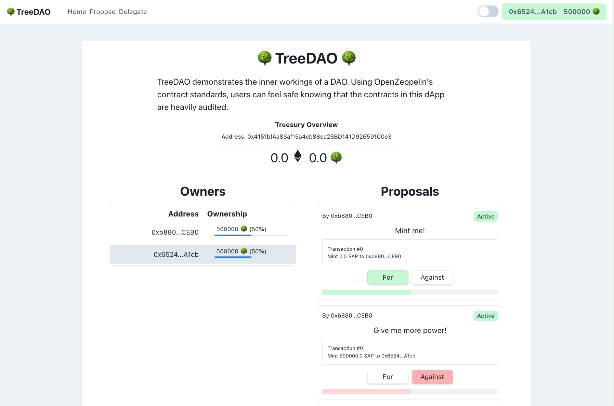
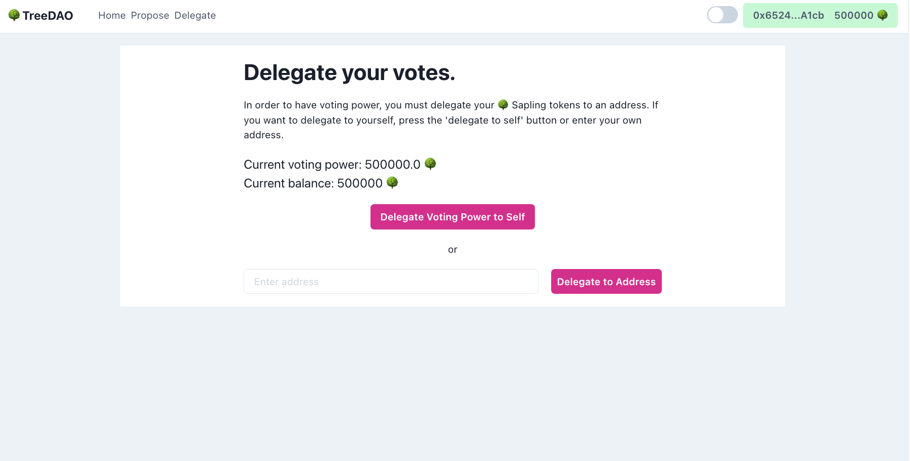

# TreeDAO 🌳

This project consists out of two parts:
- /contracts: here, the solidity code can be found that defines the governance structure of the DAO. I made use of the [openzeppelin wizard](https://wizard.openzeppelin.com/#governor) to generate these contracts. You can also find a testing script that tests some basic functionality of the governance, as well as the deploy script. If you want to deploy your own, do not forget to create a `.env.local` file from the example.

- /frontend: like the name implies, contains the frontend NextJS server that allows you to interact with the DAO; log in, create a proposal and vote on proposals.

Feel free to contribute or use this project as you like!

**Note! This work is purely meant to showcase some features and is not a finished product! Use at your own risk!**

## Showcase

If you want, you can fork the project and start the server using the following commands:
```
npm install
npm run dev
```

Also, you can view some screenshots of the TreeDAO below:



